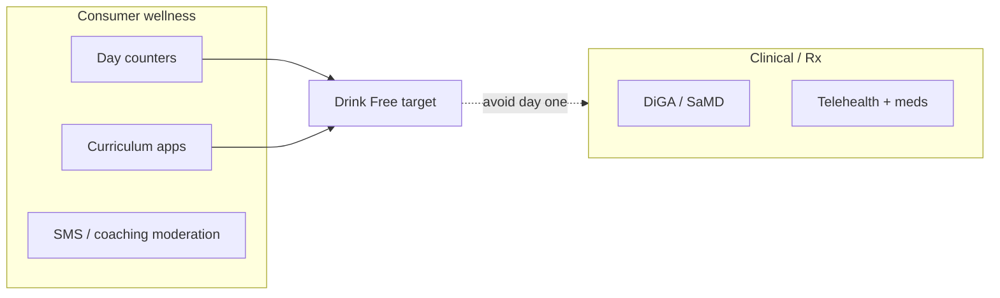

# Drink Free — market research

**Date:** 10 Aug 2026  
**Status:** Draft v1 — sources mixed (public press + analyst estimates; treat $B figures as directional)  
**Related:** [`drink-free-progress.md`](drink-free-progress.md) · competitor · pricing · keywords

---

## 1. One-line market

Adults who want to **drink less or stop** without necessarily entering clinical addiction treatment — served by consumer habit apps, seasonal challenges (Dry / Damp January), and a thin layer of digital therapeutics / Rx apps.

---

## 2. Demand drivers

| Driver | Signal | Implication for Drink Free |
|--------|--------|----------------------------|
| **Dry January / Damp January** | Huge seasonal search spike (US “dry january” ~74k searches Jan 2026; UK ~33k) | Plan UA + App Store creatives for Nov–Jan; retain with year-round dual track |
| **Sober curious** | Steady US volume (~2.9k/mo avg for “sober curious”) | Brand/content angle beyond “addiction recovery” |
| **Workplace / productivity** | Press cites alcohol’s employer cost; Reframe pushing B2B | Later channel, not MVP |
| **Fitness / calories / money** | “alcohol calories” ~1.6k/mo US, low CPC | Our twin gains (money + kcal) match real search intent |
| **Digital wellness spend** | Consumers already pay for Reframe / Sunnyside / I Am Sober Plus | Subscriptions are proven in-category |

---

## 3. Market size (directional)

| Claim | Source type | Confidence |
|-------|-------------|------------|
| “Alcohol-free challenge app” market ~$1.8B (2025) → ~$5.6B (2034), ~13% CAGR | Dataintelo syndicated report | **Low–med** — these reports often inflate; use as “category is growing,” not a TAM to pitch VCs |
| Reframe ~$13M ARR, 150k+ paying (press / aggregator claims); ~5M downloads claimed; $24.7M raised | Press / Crunchbase-style summaries | **Med** — treat as “category leader exists at eight-figure ARR” |
| Dry January cultural participation in tens–hundreds of millions (campaign claims) | Campaign / press | **Low** for exact counts; **high** for seasonality reality |

**Practical TAM framing for us (bottom-up):**
- Addressable: English-speaking smartphone users who want to quit or cut back  
- Beachhead: UK + US iOS, Dry January cohort + sober-curious year-round  
- Year-1 ambition: thousands of installs → hundreds of paid — not “capture 1% of $1.8B”

---

## 4. Customer segments

| Segment | Goal | Willingness to pay | Notes |
|---------|------|--------------------|-------|
| **Dry January trier** | 31 days off | Low unless hooked mid-month | Need free start + conversion before Feb churn |
| **Sober curious / damp** | Cut back, not identity as “alcoholic” | Med | Dual track is the product |
| **Abstinence / recovery-curious** | Quit + streak | Med–high | Competes with I Am Sober, AA-adjacent tools |
| **Fitness-motivated** | Calories / weight | Med | Lean into kcal + money charts |
| **Clinical AUD** | Treatment | High but regulated | **Out of scope** for wellness MVP (Vorvida / Monument / Ria territory) |

**Primary ICP (Drink Free):** 25–45, UK/US, social drinkers who feel “too much on weekends,” responsive to money + calories + streaks — not clinical recovery identity.

---

## 5. Seasonality

```
Nov–Dec: content + waitlist + soft launch
Jan:     peak installs (Dry / Damp)
Feb–Mar: convert trial → paid; prevent churn
Apr–Oct: retention, missions, referrals; smaller paid UA
Oct:     Sober October bump (secondary)
```

---

## 6. Category structure



Drink Free sits in **consumer wellness**: gamey tracker + missions + twin gains — between I Am Sober (streaks) and Reframe (heavy program), lighter than coaching SMS (Sunnyside).

---

## 7. Risks

- Crowded App Store; brand search already owned by Reframe / I Am Sober  
- Seasonal churn after January  
- Regulatory creep if claims get medical  
- Free charity apps (Try Dry) anchor price expectations for “tracking only”

---

## 8. Opportunities (whitespace we claim)

1. **Twin scoreboard** — money + calories as co-equal “gains” (fintech feel)  
2. **Dual track** without 160-day curriculum tax  
3. **Gamey badge / points / level** tone without shame  
4. **iOS-first** speed vs Play closed-testing drag  

---

## Sources (selected)

- Dataintelo alcohol-free challenge app report summary (2025–2034 claims)  
- Reframe Dry January 2026 BusinessWire / Hypepotamus coverage  
- DataForSEO Google Ads volumes (see keyword research doc)  
- Prior Smoke Free / DiGA notes in product research  
