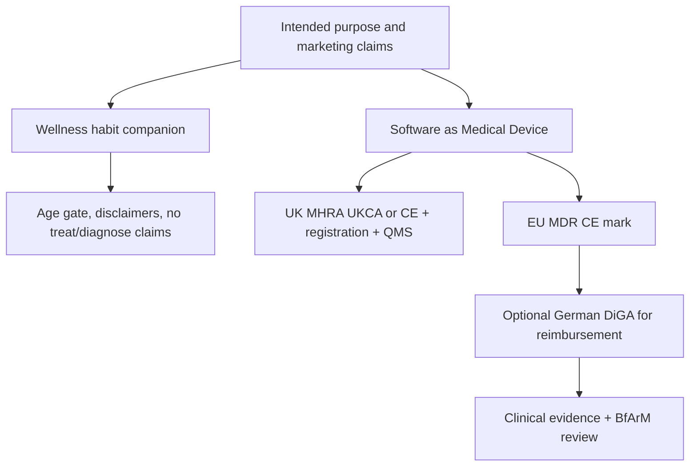

# Drink Free — product research

**Date:** 9 Aug 2026  
**Status:** Concept research + marketing preview  
**Working name:** Drink Free (final brand TBD)  
**Related:** [`drink-free-progress.md`](drink-free-progress.md) · [`drink-free-features.md`](drink-free-features.md) · [`drink-free-recommendation-tech-brief.md`](drink-free-recommendation-tech-brief.md) · market / KW / competitor / pricing / reviews / SEO docs · landing `drink-free-landing/`

**Tone:** Gamey / fintech-fun (Robinhood energy) — see features doc. Landing is light + green gains, not navy clinical.

**Disclaimer:** Regulatory section is product research, not legal advice. Counsel review required before live health claims, App Store copy, or any SaMD/DiGA path.

---

## 1. Verdict

Smoke Free’s winning loop — **progress feedback → craving tools → daily missions → identity shift → support** — ports cleanly to alcohol. The alcohol market is more crowded and already split between **quit** and **cut back**, so a clone without a dual-track model and careful claims will look late.

**Recommended first ship:** consumer wellness habit app (both tracks), freemium, no clinical “treats AUD” claims. Reserve German DiGA / medical-device GTM as a funded Phase 2.

---

## 2. Smoke Free teardown

### Positioning

| Signal | What they do |
|--------|----------------|
| Tagline | “Love not smoking” — identity, not willpower guilt |
| Proof | 8M downloads, 185k five-stars, six scientific studies, GP recommendations |
| Tone | Empathetic, non-judgemental about lapse, “your quit, your way” |
| Visual | Deep navy + gold accents; phone mockup as hero; trust-heavy |

### App information architecture (from marketing)

Bottom nav (hero mockup): **Dashboard · Support · Diary · Cravings · Missions**

| Pillar | Features surfaced on site |
|--------|---------------------------|
| Progress | Time smoke-free; health milestones (~15 body systems); money saved → treat countdown |
| Motivation | Personal reasons; identity framing |
| Cravings | Log severity; what worked; trigger awareness |
| Missions | Daily tasks; weekly check-ins; claimed ~2× quit odds in RCT |
| Support | Community chat; human advisors; daily clinics; Quit Coach chatbot (further efficacy claims) |
| Plan | Personalised stop-smoking plan; NCSCT-aligned behavioural techniques |

### Behavioural theory (public materials)

- Progress feedback when motivation dips  
- Identity change (non-smoker identity)  
- Lapse ≠ failure; learn and continue  
- Behaviour change techniques aligned with NICE / NCSCT (UK stop-smoking practice)  
- Founder Dr David Crane: PhD in app-delivered behaviour change; also co-developed **Drink Less** (alcohol reduction research app)

### Monetization signals

- Free + Pro (reviews push paid version)  
- Advisor / clinic / chatbot as premium depth  
- Germany: separate **DiGA** product path (prescription / insurance) via Smoke Free 23 GmbH  

### What to copy

- Progress dashboard as emotional core (timer + money + health)  
- Craving log + triggers  
- Short daily missions + weekly check-in  
- Identity-forward copy (“love not drinking”)  
- Non-judgemental lapse handling  
- Marketing: one composition, brand-first hero, science/trust below fold  

### What to skip (v1)

- Staffed human clinics / 24/7 advisors (Smoke Free’s moat; expensive)  
- Unsubstantiated “clinically proven” / “doubles your chances” claims without our own evidence  
- Cloning trademarks, assets, or near-identical UI chrome  

---

## 3. Alcohol market map

| App | Primary goal | Standout | Pricing signal | Gap vs Drink Free angle |
|-----|--------------|----------|----------------|-------------------------|
| **I Am Sober** | Quit / abstinence | Day counter, daily pledge, community | Free + premium | Thin on missions + health timeline depth |
| **Reframe** | Cut back or quit | Neuroscience / CBT program, coaching | Subscription (~$99+/yr class) | Heavy program; less “simple Smoke Free dashboard” |
| **Try Dry** | Dry Jan / flexible | Units, money, calories; “drank as planned” | Free (charity) | Light on gamified missions / identity |
| **Sunnyside** | Moderation | SMS coaching, weekly plans | Subscription | Not a rich in-app progress theatre |
| **Drink Less** | Reduce (research) | Academic BCTs; RCT history | Free / research | Not consumer-brand polished |
| **Vorvida** | Harmful use / dependence | German **DiGA**, CBT web program | Insurer / Rx | Clinical, DE-first; not App Store lifestyle brand |
| **Nomo / Sober Time** | Streaks | Multi-addiction clocks | Free + IAP | Generic counter, not alcohol-specialised UX |

### Whitespace hypothesis

**“Smoke Free–grade progress theatre + dual track (quit *or* cut back) + honest wellness positioning.”**

- Own the **dashboard emotion** (time / money / health / treats) that I Am Sober underplays  
- Own **both goals** in one product (Reframe does this with a heavy curriculum; we stay lighter and mission-led)  
- Do **not** compete with Vorvida on DiGA day one  

---

## 4. Dual-track product model

### Onboarding

1. Age gate (**18+**)  
2. Goal: **Quit** or **Cut back** (can change later)  
3. Baseline: typical drinks/week, spend per drink or week, quit/cut-back date  
4. Optional short screen inspired by AUDIT-C **as self-reflection only** — copy: “Higher scores often mean professional support helps more. We’re a habit tool, not a diagnosis.” Soft escalate to NHS / SAMHSA / local helplines — never label AUD  
5. Reasons (why) + optional first treat goal  

### Shared core (both tracks)

| Module | Behaviour |
|--------|-----------|
| Progress | Streak / days since last drink *or* days within plan; money saved; calories/units avoided (estimate) |
| Cravings | Severity, context, what helped; trigger patterns over time |
| Diary | Free text + mood |
| Missions | Daily micro-tasks (urge surfing, plan the evening, text a friend, delay 15 min) |
| Weekly check-in | Reflect, adjust plan, celebrate |
| Reasons & treats | Motivation + reward countdown from savings |
| Lapse flow | Reset or log; learn; no shame UI |

### Quit track

- Primary metric: **time alcohol-free**  
- Health timeline (evidence-cited where possible; clearly “typical / illustrative,” not personal medical prediction): sleep, hydration, mood stability, resting HR trends (if user links Health later), liver-related *general* education — avoid diagnostic language  
- Identity copy: “Love not drinking”  

### Cut-back track

- Primary metric: **weekly drink/unit budget** vs actual  
- Log: drank / didn’t / **drank as planned** (Try Dry pattern)  
- Charts: weekday vs weekend, context tags (social, stress, habit)  
- Missions tuned to limits, alternatives, social scripts  

### Support (phased)

| Phase | Support |
|-------|---------|
| MVP | Static tips, crisis/help links, optional community later |
| v1.5 | Scripted coach / FAQ bot (careful claims) |
| Later | Human moderation or partnerships; DiGA clinical stack only if funded |

---

## 5. MVP scope (defined now, build later)

**In**

- Onboarding (dual track)  
- Dashboard (timer or budget + money + simple health/education tiles)  
- Craving log + trigger tags  
- Daily missions (content pack, offline-capable)  
- Weekly check-in  
- Local-first storage (or light sync); push reminders  
- Safety: 18+, crisis resources, wellness disclaimers  

**Out of MVP**

- Human advisors / live clinics  
- Unvalidated “clinically proven” marketing  
- Wearable medical claims  
- DiGA / MHRA device registration  
- Social feed (moderation cost)  

**Tech lean (suggestion):** Expo / React Native or Flutter; SQLite/local; optional Supabase later for accounts.

**Monetization sketch:** Free core tracker; Pro = missions history, advanced charts, treat planner, custom reminders. Price against Reframe (below heavy coaching) and I Am Sober Plus.

---

## 6. Go-to-market hypotheses

1. **Consumer freemium first** (UK/US App Store) — Dry January and “sober curious” as seasonal spikes; year-round dual track as retention.  
2. **Tone:** science-*informed* (cite public literature, BCTs) without claiming our app is proven until we have data.  
3. **Creative:** before/after savings, craving survived, day-30 identity — not clinical white-coat ads.  
4. **Partnerships later:** employers, insurers, public health — only with evidence and regulatory posture that matches.  
5. **Germany DiGA:** optional Phase 2 if clinical budget + DE entity; alcohol DiGA already exists (Vorvida).  

### Positioning one-liner

> Drink Free helps you quit drinking or cut back — with a clear progress dashboard, craving tools, and daily missions. A habit companion, not a medical treatment.

---

## 7. Regulatory & risk appendix

### Why Smoke Free faced hurdles

Regulatory load tracks **intended purpose + claims + market**, not “apps about habits are illegal.”

| Layer | What Smoke Free did | Why it matters |
|-------|---------------------|----------------|
| **Germany DiGA** | Permanent BfArM listing for tobacco dependence (**ICD-10 F17.2**); Class I MDR device; Rx / insurer reimbursed via Smoke Free 23 GmbH | Highest bar: clinical evidence, QMS, security (ISO 27001 cited), vigilance, DE manufacturer |
| **EU MDR** | Marketed DE product as Class I medical device (Rule 11 context in store copy) | CE marking, technical file, post-market surveillance |
| **UK** | Built to MHRA app guidance; NICE + NCSCT-aligned advisors/chatbot; public disclaimer not NHS/DoH endorsed | Clinical-style support invites regulator attention; MHRA FOI exists around the product |
| **US FDA** | Motivational quit apps often meet *device* definition but sit in **enforcement discretion** if limited to education / reminders / motivation | “Treats nicotine addiction” / diagnosis / clinical decision support exits the safe lane |

**Alcohol parallel:** Germany already lists **Vorvida** as a permanent DiGA for harmful alcohol use / dependence (F10.1 / F10.2). The reimbursed clinical niche is occupied; consumer App Store is still open.



### Claim boundary table (product guidance)

| Safer wellness framing | Higher-risk / SaMD-leaning framing |
|------------------------|-------------------------------------|
| “Track dry days and money saved” | “Treats alcohol use disorder” |
| “Tools to build healthier drinking habits” | “Diagnoses alcohol dependence” |
| “Educational health milestones (illustrative)” | “Monitors liver disease / predicts your recovery” |
| “Missions based on behaviour-change ideas” | “Clinically proven to cure addiction” |
| “Not a substitute for professional care” | “Prescribed digital therapy” (unless actually DiGA) |
| Soft AUDIT-C reflection + help links | “Your AUDIT score means you have AUD” |

**Drink Free v1 intended purpose (proposed):**  
A consumer lifestyle app for adults who want to stop drinking or reduce alcohol intake, providing self-tracking, motivational feedback, craving logging, and educational tips. **Not** intended to diagnose, treat, cure, or prevent disease, and **not** a substitute for medical or psychological care.

### Safety UX requirements

- **18+** age gate  
- Persistent disclaimer: wellness tool, not medical care  
- Crisis / help resources (jurisdiction-aware: e.g. NHS / Samaritans UK; 988 / SAMHSA US)  
- If user indicates severe distress or dependence red flags → prompt to seek professional help; do not attempt clinical chatbot crisis therapy in MVP  
- Lapse: non-punitive reset  
- Medical contraindication copy where relevant (e.g. abrupt stop after heavy dependence can need medical supervision — surface carefully with “talk to a clinician”)  

### Privacy & stores

- Alcohol logs and craving data can be **special category / health-related** under GDPR — minimize collection, clear purpose, strong security  
- App Store / Play: Health & Fitness or Lifestyle; avoid implying Medical Device unless registered  
- Advertising (ASA/FTC): no unsubstantiated cure / “clinically proven” claims  

### Optional Phase 2 — DiGA / SaMD roadmap (only if funded)

1. Lock medical intended purpose (e.g. support for harmful use / dependence codes)  
2. Quality management system + clinical evaluation plan  
3. CE / UKCA pathway; DE legal manufacturer if DiGA  
4. RCT or robust real-world evidence  
5. BfArM DiGA application (alcohol indication already has Vorvida as competitor)  
6. Vigilance, updates under change control  

**Do not** start DiGA work in parallel with consumer MVP unless there is explicit budget and counsel.

---

## 8. Marketing concept (preview)

**Primary (build this):** React + Tailwind site in **`drink-free-landing/`**

```bash
cd drink-free-landing && npm install && npm run dev
```

Static HTML sketch retained in **`drink-free-preview/`** for reference.

| Block | Intent |
|-------|--------|
| Hero | Brand-first “Drink Free” + “Love not drinking” + dual-track subline + phone mock |
| Proof strip | Aspirational placeholders (honest until real metrics) |
| How it works | Progress · Cravings · Your plan |
| Dual track | Quit vs Cut back |
| Trust | Explicit not-a-medical-device / not-a-substitute-for-care |
| CTA | Waitlist — no fake clinical badges |

Visual system: navy `#0B1F3A` + gold `#D4A017` + soft sky accents (Smoke Free–adjacent energy, not a clone).

**Ship order:** landing page → **iOS first** (TestFlight). Android deferred — Google Play’s 12-tester / 14-day closed testing requirement is a known pain for new accounts.
---

## 9. Open decisions

| Decision | Default for research |
|----------|----------------------|
| Final brand name | Working: Drink Free |
| Primary launch market | UK + US English; **iOS first**, Android later |
| Distribution | Landing (React) → TestFlight → App Store; Play after closed testing is worth it |
| Pro price | TBD after competitive scrape at build time |
| Community in v1 | No |
| DiGA | Phase 2 only |

---

## 10. Sources (selected)

- [Smoke Free](https://smokefreeapp.com/) — home, about the app, about us, practices and procedures  
- [Smoke Free DE / DiGA](https://smokefree.de/) — Class I MDR + BfArM DiGA (F17.2)  
- [Vorvida DiGA](https://www.diga-verzeichnis.de/diga/vorvida) — alcohol DiGA precedent  
- MHRA: medical device software / apps guidance (GOV.UK)  
- FDA: Policy for Device Software Functions and Mobile Medical Applications (enforcement discretion examples include motivational guidance for smokers / addiction recovery)  
- Crane et al. Drink Less literature (alcohol reduction app modules / RCTs)  
- Competitor landscape summaries: Reframe, I Am Sober, Try Dry, Sunnyside (2025–2026 reviews)
