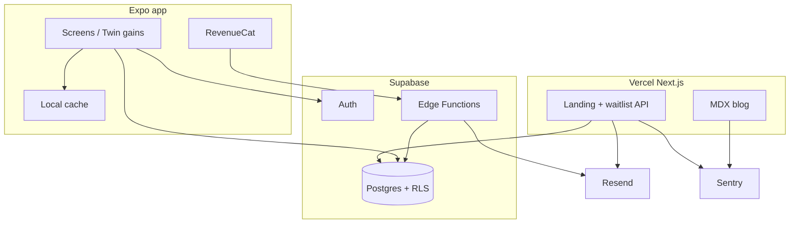

# Drink Free — recommendation & tech brief

**Date:** 10 Aug 2026  
**Status:** Build-from brief (decisions locked for v1)  
**Audience:** You + any engineer/agent implementing landing + iOS app  
**Related:** features · pricing · reviews · SEO series · progress log

---

## 1. Executive recommendation

**Build two surfaces, one brand:**

| Surface | Job | When |
|---------|-----|------|
| **1. Marketing site** | Waitlist, SEO blog, twin-gains story, radical pricing clarity | Now → ship continuously |
| **2. Standalone iOS app** | Daily habit game: quit *or* cut back; money + calories; missions; points | After waitlist live; TestFlight before Dec for Jan |

**Do not** chase Reframe’s curriculum/coaching or DiGA/clinical day one.  
**Do** occupy the open slot: alcohol-specialist + Smoke Free–style progress theatre + gamey retention + honest freemium (I Am Sober trust, Try Dry’s money/kcal, without charity-only or billing scars).

**One-liner:** Drink Free is the Robinhood-style scoreboard for drinking less — money kept, calories not added, missions that earn points.

---

## 2. Best ideas (prioritized)

### Must-win product ideas
1. **Twin gains scoreboard** — £/$ saved and kcal not added as co-equal heroes  
2. **Dual track** — Quit *or* Cut back, switchable, same core loop  
3. **Game loop** — missions → points → levels → badges (say “points,” never “XP”)  
4. **Treat vault** — savings become a quest, not a spreadsheet  
5. **Billing trust as a feature** — price visible before deep disclosure; free core always useful (counter Reframe review poison)

### Must-win GTM ideas
1. **iOS first** (skip Play closed-testing drag for launch)  
2. **Dry January as launch season** — waitlist Nov, TestFlight Dec, push Jan  
3. **SEO pillars first** — alcohol calories + money saved (see blog series)  
4. **Freemium @ ~$7.99/mo or $49.99/yr** (£6.99 / £39.99)

### Explicitly defer
- Human coaching, live community, DiGA/SaMD, Android, multi-addiction tracking

---

## 3. Cost suggestions

### Product pricing (customer)
| SKU | Price | What’s unlocked |
|-----|-------|-----------------|
| Free | $0 | Dual-track onboarding, streak/budget, twin gains (basic), 1 mission/day, starter badges, craving log, safety links |
| **Pro monthly** | **$7.99 / £6.99** | Full missions, chart ranges, treat vault, custom drinks, richer reminders |
| **Pro annual** | **$49.99 / £39.99** | Same + push as default offer (“less than a round a month”) |
| Trial | 7-day Pro **or** 14-day Pro in Jan campaign | Convert before Feb churn |

### Build / run costs (order-of-magnitude, solo or small team)

| Item | Ballpark | Notes |
|------|----------|--------|
| Domain + DNS | ~$15/yr | |
| Landing hosting (Vercel) | $0–20/mo | Hobby → Pro if traffic |
| Email (Resend / Loops / Buttondown) | $0–30/mo early | Waitlist + blog digest |
| Supabase / backend (app sync) | $0–25/mo early | Free tier OK at start |
| Apple Developer | $99/yr | Required |
| Design assets / Lottie | $0–200 one-off | Optional |
| Paid UA (optional Jan) | $500–5k test | Only after organic baseline |
| Legal review (privacy + wellness claims) | $500–2k once | Before App Store claims harden |
| **v1 build labor** | DIY / agent-assisted | Expo app ~4–8 weeks part-time; landing ongoing |

**Rule:** Cap burn until waitlist conversion and TestFlight retention are known.

---

## 4. In-app features (v1 ship list)

### Loop
`See gains → Mission → Log drink/craving → Numbers move → Celebrate → Repeat`

### Screens / modules (MVP)

| Area | Spec |
|------|------|
| **Onboarding** | 18+ gate → Quit or Cut back → usual drink (preset) + price → start date → reason(s) → disclaimer |
| **Home** | Hero (days free *or* week budget) · Money card + sparkline · Calories card + sparkline · Today’s mission CTA · Level bar |
| **Log** | Skip / drank / drank-as-planned · preset kcal+price · craving severity + tags |
| **Missions** | 1 free/day; Pro = up to 3 · points on complete |
| **Gains** | Charts 7d / 30d / all (Pro for full history) · treat vault (Pro) |
| **Badges** | Starter set free; seasonal/epic Pro |
| **Settings** | Track switch, drink presets, currency £/$, cancel Pro instructions, crisis links, export/delete |
| **Lapse** | Non-shame “new run” · keep history |

### Safety / regulatory (non-negotiable)
- Wellness tool, not a medical device  
- No diagnose/treat AUD language  
- Crisis / help resources always free  
- Calorie figures labelled estimates  

### Pro vs Free (summary)
Free = oxygen (streak + twin gains basics).  
Pro = depth of the game (missions, vault, charts, widgets later).

---

## 5. Landing page brief

### Goal
Collect emails + SEO → educate twin gains → set pricing expectations honestly → iOS waitlist.

### Stack (locked — your existing tools)

No new vendors. Reuse what you already run elsewhere:

| Layer | Choice | Role |
|-------|--------|------|
| Host | **Vercel** | Site + API routes / server actions |
| App framework | **Next.js** on Vercel (migrate from current Vite prototype) | SSR/SEO for blog; matches your other projects |
| UI | React + Tailwind (port existing `drink-free-landing` components) | Keep visual work |
| Blog | **MDX in-repo** (`web/src/content/blog`) | SEO posts from blog series; no CMS |
| Waitlist + users | **Supabase** (Postgres table + RLS) | Own the list |
| Email | **Resend** | Waitlist confirm + digests + transactional |
| Errors | **Sentry** | Next.js client + server monitoring |
| Analytics | Vercel Analytics (already in ecosystem) | Enough for v1 |

Current Vite prototype in [`drink-free-landing/`](drink-free-landing/) is a **design prototype** — fold it into a Next.js project on Vercel for production.

### Landing IA
1. Hero (brand + twin gains + phone mock)  
2. Twin scoreboard (money + calories)  
3. How you play (missions / badges)  
4. Quit vs cut back toggle  
5. Pricing honesty block (Free vs Pro — *before* waitlist form)  
6. Trust (not medical device)  
7. Waitlist (Supabase insert → Resend confirm)  
8. Footer → Blog (MDX)  

### Landing backlog (priority)
1. Next.js app on Vercel; port UI from Vite prototype  
2. Supabase waitlist table + Resend confirm  
3. MDX blog; publish posts 1–5  
4. Pricing section matching SKUs  
5. Custom domain + OG images  

---

## 6. App tech brief (standalone)

### Platform
- **iOS first** via **Expo (React Native) + TypeScript**  
- EAS Build + TestFlight  
- Android: same Expo app later  

### Backend (required — not optional)

**Supabase from day one** for:

| Concern | Supabase piece |
|---------|----------------|
| Accounts | Auth (Apple / email) |
| Profile + track (quit/cut-back) | Postgres + RLS |
| Sync logs, gains, missions progress | Tables + optional Realtime |
| Pro entitlement mirror | Profile flag updated via webhook / Edge Function |
| Privacy | RLS so users only read their rows |

Local cache on device (SQLite or SecureStore + Zustand) for snappy offline UX — **source of truth remains Supabase** once signed in.

### Stack (locked)

| Layer | Choice |
|-------|--------|
| Client | Expo + Expo Router + TypeScript |
| Backend | **Supabase** (Auth, Postgres, Edge Functions, Storage if needed) |
| IAP | RevenueCat → webhook → Supabase (only mobile-specific add; no substitute in your current web stack) |
| Push | Expo Notifications |
| Email (account/lifecycle) | **Resend** (same as web) |

Marketing site stays on **Vercel + Next.js + Resend + Supabase + Sentry** (MDX blog in-repo); app talks to the **same Supabase project** (or a dedicated Drink Free project in the same org).

### Architecture



### Key libraries (app)
| Need | Package |
|------|---------|
| Navigation | Expo Router |
| Supabase | `@supabase/supabase-js` |
| State | Zustand |
| Charts | Victory Native / Skia sparkline |
| IAP | RevenueCat |
| Haptics | expo-haptics |
| Animations | Reanimated |

### App module map
```
app/
  (onboarding)/
  (tabs)/
    home/
    log/
    missions/
    gains/
    settings/
src/
  domain/     # drink presets, calorie math, money math, points
  lib/supabase/
  features/
  ui/
```

### Shared with landing
- Design tokens + logo  
- Drink calorie presets  
- Same Supabase project (waitlist vs `profiles` / `drink_logs` schemas)  
- Disclaimer copy  

### Release checklist (app)
1. Age gate + wellness disclaimer  
2. Privacy policy + terms on Vercel site  
3. Supabase Auth + RLS policies reviewed  
4. RevenueCat products + webhook → Supabase  
5. Cancel-subscription help screen  
6. TestFlight → soft launch → Jan push  

---

## 7. Build sequence (recommended)

| Phase | Weeks | Deliverable |
|-------|-------|-------------|
| **A** | 1 | Landing live: domain, waitlist, pricing block, analytics |
| **B** | 1–2 | Blog posts 1–2 live; SEO index |
| **C** | 2–6 | Expo MVP: onboarding, home twin gains, log, missions, freemium flag |
| **D** | 6–7 | RevenueCat + paywall clarity + TestFlight |
| **E** | 7–8 | Polish badges/points; store listing; privacy policy |
| **F** | Nov–Jan | Seasonal content + acquisition |

Landing and app can overlap: **A/B in parallel with C**.

---

## 8. Success metrics

| Surface | North-star metric |
|---------|-------------------|
| Landing | Waitlist emails / week; blog → signup rate |
| App | D1 / D7 open rate; free→Pro %; Jan→Feb retention |
| Brand | App Store rating ≥4.7 with **no billing 1★ cluster** |

---

## 9. Decision log (locked for v1)

| Decision | Choice |
|----------|--------|
| Markets | US + UK English |
| Platform | iOS first (Expo → Android later) |
| Positioning | Gamey twin gains, dual track, wellness |
| Monetization | Freemium Pro ~$8/mo or $50/yr |
| **Web stack** | **Vercel + Next.js + Supabase + Resend + Sentry** (MDX blog) · domain **godrinkfree.com** |
| **App stack** | **Expo + Supabase + Resend + RevenueCat** |
| New vendors | None except RevenueCat for IAP + Sentry for errors |
| Community / coaching | Out |
| Clinical / DiGA | Out |

---

## 10. Immediate next actions

1. Spin up Drink Free **Supabase** project (or schema in existing org)  
2. **Next.js on Vercel**: port landing UI; **Resend** waitlist; **MDX** blog; **Sentry**  
3. Scaffold Expo app wired to same Supabase Auth  
4. Privacy policy page before TestFlight  
5. Domain: **`godrinkfree.com`** → Vercel  

This brief is the source of truth for implementation until explicitly revised.
