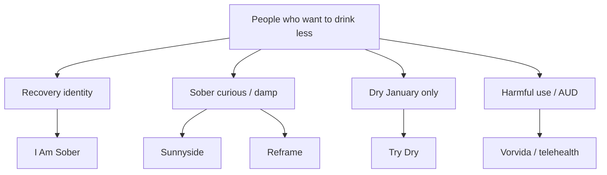

# Why Smoke Free is huge — and there’s no equal “Drink Free”

**Date:** 10 Aug 2026  
**Question:** Smoke Free dominates stop-smoking apps. Why isn’t there an equally iconic alcohol twin?  
**Related:** reviews · market · competitor

---

## Short answer

There **is** scale in alcohol apps — **I Am Sober** (huge multi-addiction counter) and **Reframe** (alcohol-specialist, strong revenue). What’s missing is a **single, beloved, alcohol-only brand** with Smoke Free’s combo of: freemium trust + progress theatre + science story + decade of compounding + clean review narrative.

Alcohol demand is real but **structurally harder to own** than smoking.

---

## 1. Smoking is a cleaner product problem

| | Smoking | Drinking |
|--|---------|----------|
| Social default | Increasingly stigmatized | Still default at dinners, weddings, sports |
| Goal shape | Mostly **quit** (abstinence) | Split: quit **or** cut back (“I’m fine, I just…”) |
| Identity | “Ex-smoker” is a proud badge | “Sober” can feel clinical / AA-coded for casual drinkers |
| Search language | quit smoking / stop smoking | Many avoid “alcoholic”; use Dry January, sober curious, drink less |
| Relapse framing | Clear lapse | Social pressure to “just have one” every weekend |

Smoke Free’s “Love not smoking” identity maps cleanly. Alcohol needs **two products in one** (our dual track) or you lose half the market.

---

## 2. The category already fragmented the “king” slot

No single app owns all four jobs. Smoke Free mostly owned **one job**: quit cigarettes.

---

## 3. Free charity + seasonal spike undercut a commercial “default app”

- **Try Dry** is free, official Dry January, tracks money + calories + units. That caps what people will pay for “just tracking.”  
- **January** creates a flood then a cliff — harder to compound reviews year-round like a daily smoker quitting in any month.  
- Smoke Free users open the app for months as the timer becomes identity. Dry January users often churn in February.

---

## 4. Monetization poisoned trust for the alcohol leader

Reframe is the closest “big alcohol app,” but review themes show **billing/trial anger** (Trustpilot much worse than star average). Smoke Free’s public story is “Pro helped me quit,” not “they charged my card.”

A category king needs **love at scale**. High stars + billing hate ≠ Smoke Free.

---

## 5. Science / public-health rails favored tobacco first

- Smoking cessation has longer digital RCT history, quitlines, NCSCT-style playbooks.  
- Smoke Free rode **advisors + missions RCTs + DE DiGA**.  
- Alcohol digital evidence exists (Drink Less, etc.) but commercial alcohol apps leaned curriculum/community paywalls more than “GP-recommended quit tool.”  
- Same founder (Crane) researched **Drink Less** academically while scaling **Smoke Free** commercially — tobacco paid the bills and brand.

---

## 6. Stigma and privacy

People screenshot sober counters less freely than “money saved not smoking.” Alcohol sits closer to mental health / dependence fear → softer ASO, less viral sharing, more private use.

---

## 7. So is the opportunity dead?

**No — it’s open for a different archetype.**

| What Smoke Free perfected | Alcohol-market version |
|---------------------------|------------------------|
| Time smoke-free | Time alcohol-free **or** on-plan week |
| Money saved | Money saved **+ calories not added** |
| Missions | Points + badges (gamey, not lecture) |
| Love not smoking | Love not drinking / proud cut-back |
| Trust | Radical pricing clarity vs Reframe scar |
| Year-round habit | Survive post-January with dual track |

**Whitespace:** Alcohol-specialist (not multi-addiction), twin gains, freemium that’s actually useful, dual track, gamey retention — without clinical DiGA day one.

I Am Sober proved **counter + community** scales. Reframe proved **people pay** for alcohol change. Try Dry proved **money + calories** matter. Nobody combined them with Smoke Free’s emotional dashboard and clean commercial trust yet.

---

## 8. Implication for Drink Free

Don’t try to “be Smoke Free copy-paste.” Be the app that makes drinking change feel like **watching a portfolio go up** — then earn the long review arc Smoke Free has by not torching trust on billing.
